# FluxDown

[中文](README.md)

FluxDown is a multi-protocol downloader for desktop and mobile, with a CLI, desktop GUI, and mobile app.

## Targets

- Desktop: Windows, macOS, Linux
  - CLI: `fluxdown`
  - GUI: Tauri + React
- Mobile: Android, iPhone
  - App: Flutter
- Shared engine: Rust core crate

## Documentation

- [Documentation index](docs/README.md)
- [Requirements](docs/requirements.md)
- [Business notes](docs/business.md)
- [Technical architecture](docs/architecture.md)
- [Protocol support matrix](docs/protocols.md)
- [Download verification status](docs/download-verification.md)
- [Build and release](docs/build-release.md)
- [Operations and security](docs/operations-security.md)
- [Roadmap](docs/roadmap.md)

## Release highlights

- The default repository documentation now opens in Chinese; this English README remains available as [README.en.md](README.en.md).
- The desktop GUI is now focused on two pages: download queue and settings. Windows, macOS, and Linux share the same Tauri UI.
- The Android queue view is grouped by status and task rows show start/end time, elapsed time, downloaded/total size, real-time speed, and average speed.
- New task creation supports clipboard input, QR scanning, protocol/backend preview, save-as filename, and output folder selection.
- Settings now cover download location, concurrent downloads, download thread count, retry count, and max download speed.
- Torrent and magnet tasks update to the real file name after metadata arrives; Android supports multi-file selection, while the desktop CLI/Tauri command path supports selecting files by torrent file index.
- CLI output and desktop display redact URL usernames and passwords, while the original source remains available for download and copy actions.
- CLI and desktop downloads sanitize save-as names to a single file name before writing inside the selected output directory.
- CLI and desktop task creation support optional SHA-256 verification; mismatches fail direct downloads or mark queued tasks as failed.
- Windows, macOS, Android, and iOS now have current screenshots and verification notes. Windows has passed CLI direct/queued HTTP downloads plus a foreground GUI HTTP download loop.
- macOS has passed scripted release CLI protocol downloads, desktop Tauri-command protocol downloads, and foreground GUI HTTP/HLS/Torrent/Magnet download loops.
- Android real-device verification covers local protocol fixtures plus media-sized HLS, torrent, and magnet foreground app flows. iOS currently has simulator UI and build-artifact verification; signed IPA and real-device download validation remain pending.
- Linux currently has CLI/GUI build-artifact existence checks only; real GUI download validation on a Linux desktop is still pending.

## Screenshots

### Windows Desktop

| Queue | New Task | Settings |
| --- | --- | --- |
| 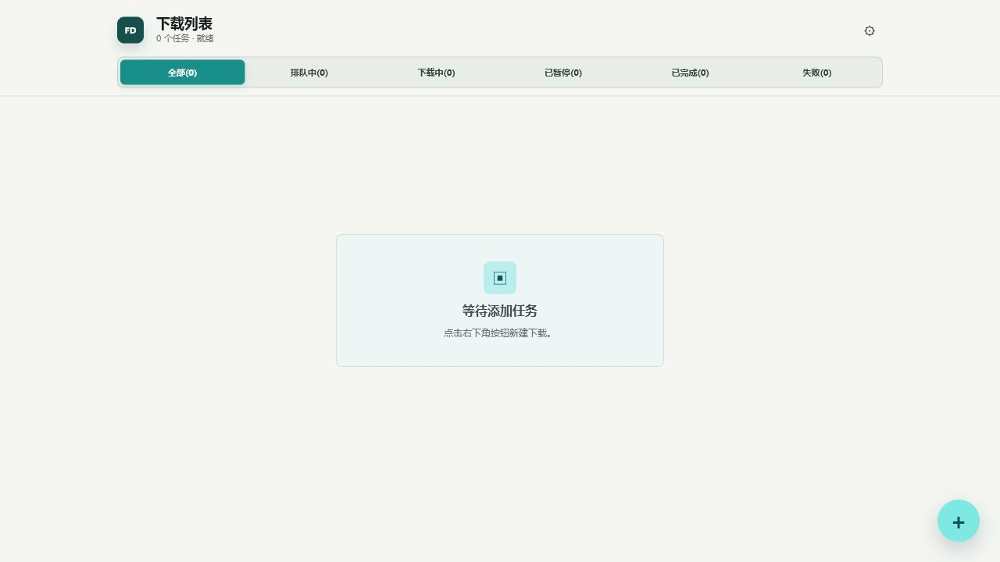 | 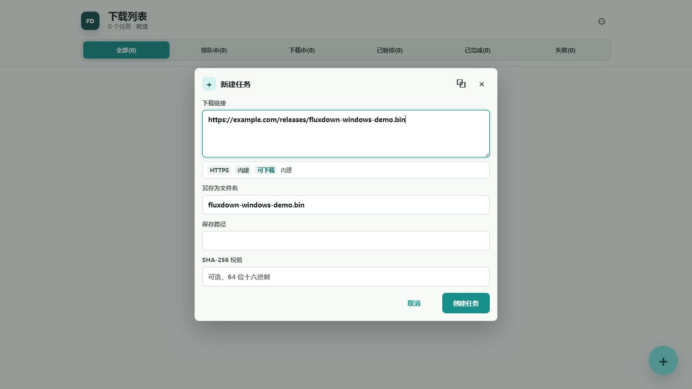 | 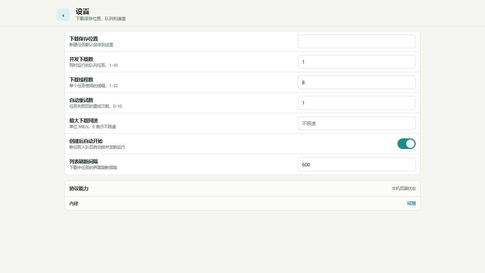 |

### macOS Desktop

| Queue | New Task | Settings |
| --- | --- | --- |
| 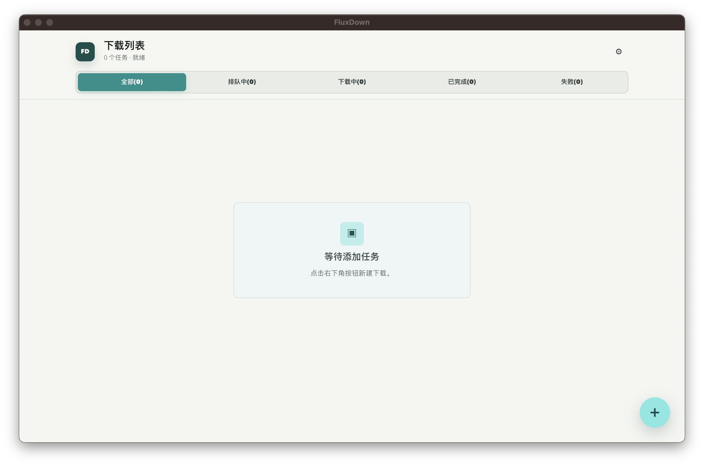 | 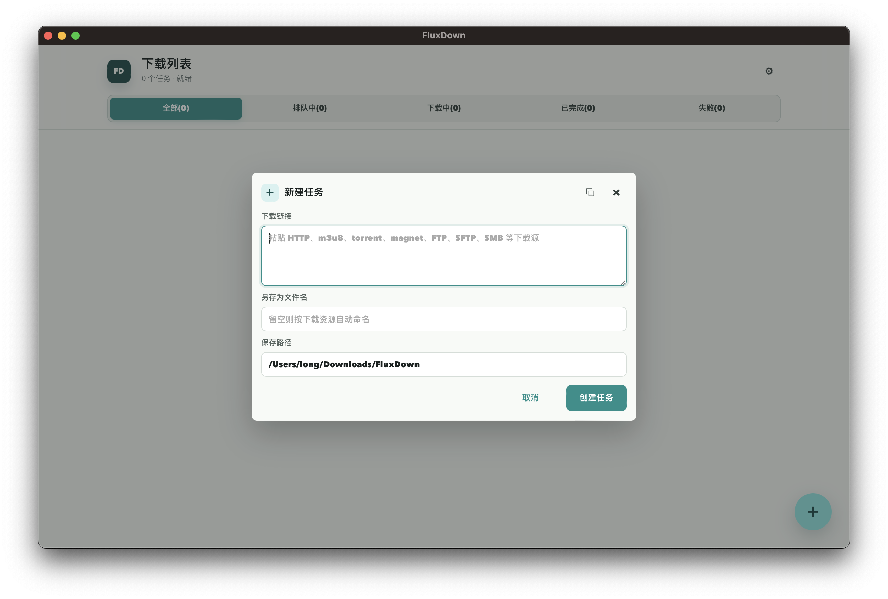 | 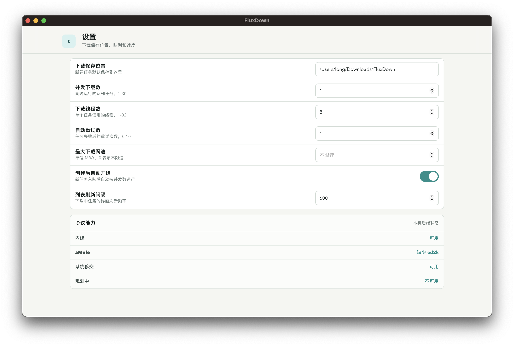 |

### Android Real Device

| Queue | New Task | Settings |
| --- | --- | --- |
| 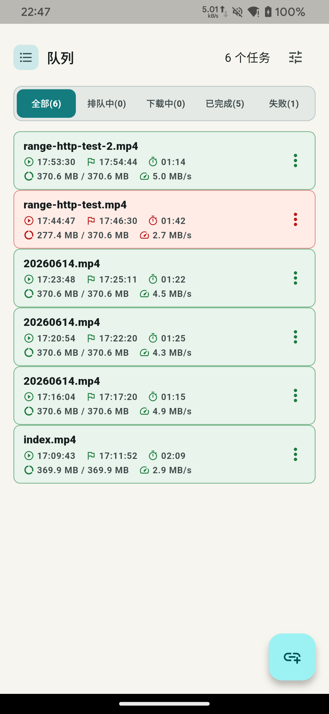 | 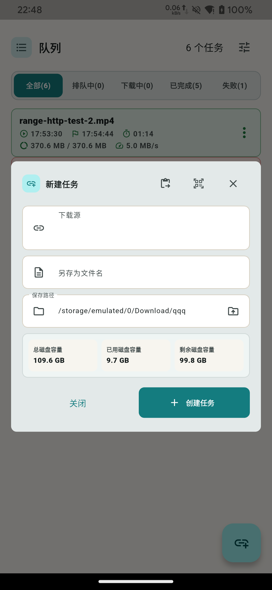 | 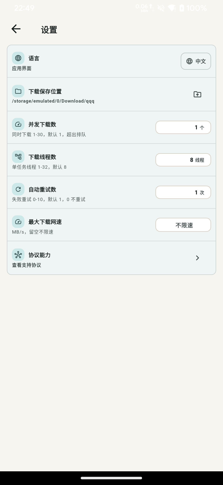 |

### iOS Simulator

| Queue | New Task | Settings |
| --- | --- | --- |
| 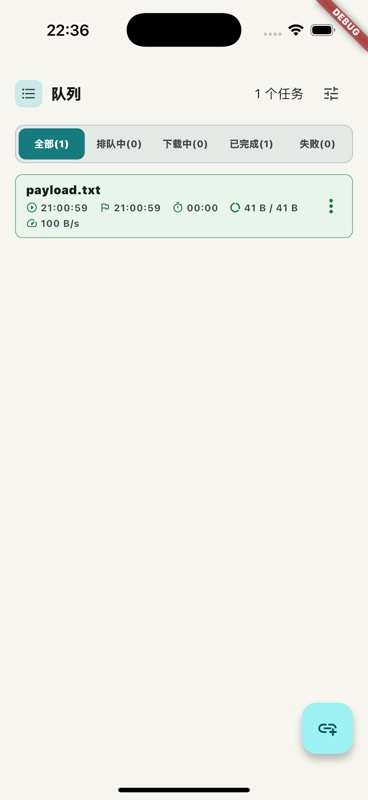 | 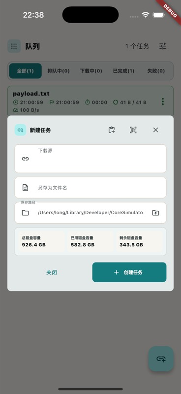 | 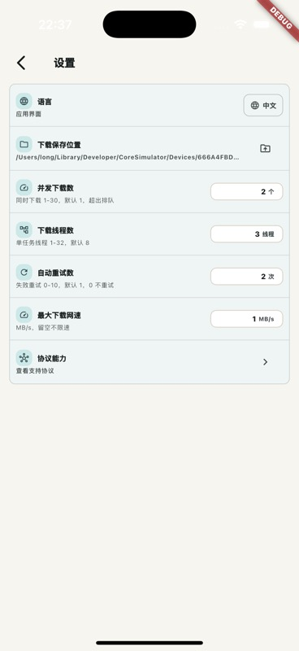 |

## Verification Progress

| Platform | Verified | Current boundary |
| --- | --- | --- |
| Windows Desktop | Native release build, CLI HTTP direct download, CLI queued download, Tauri-command HTTP queued download, foreground GUI HTTP download, and output SHA-256 verification have passed. README screenshots cover queue, new task, and settings. | Foreground GUI clicking currently covers HTTP only; FTP/FTPS/SFTP/SMB/IPFS/WebDAV/Torrent/Magnet remain covered mainly through CLI or Tauri-command real-download tests. |
| macOS Desktop | Release CLI covers HTTP/HLS/FTP/FTPS/SFTP/SMB/Torrent/Magnet plus queue controls. Foreground GUI covers HTTP/HLS/Torrent/Magnet. Tauri commands cover HTTP/HLS/WebDAV/FTP/FTPS/SFTP/SMB/IPFS/Torrent/Magnet. | Foreground GUI FTP/FTPS/SFTP/SMB/IPFS/WebDAV loops are still planned separately. |
| Linux Desktop | Linux CLI, GUI executable, `.deb`, and `.rpm` build artifacts have existence/non-empty checks. | Installing or launching the GUI on a Linux desktop and completing a real download has not been verified yet. |
| Android Real Device | Redmi Note 8 Pro foreground app verification covers local HTTP/HTTPS/FTP/FTPS/SFTP/SMB/IPFS, small HLS, small torrent, small magnet, media-sized HLS, and single/multi-file torrent and magnet cases. | Store distribution still needs signing, license, and background-behavior validation. |
| iOS Simulator | Simulator screenshots, Flutter simulator/unsigned-device build artifacts, and URL-scheme configuration checks are in place. | Signed IPA, iPhone installation, and in-app real-download validation are still pending. |

See [Download verification status](docs/download-verification.md) for detailed evidence, commands, and remaining gaps.

## Protocol roadmap

The task model recognizes these transfer families:

- HTTP and HTTPS
- WebDAV and WebDAVS
- FTP and FTPS
- BitTorrent `.torrent`
- Magnet links
- ed2k
- m3u8 / HLS
- SFTP
- SMB
- IPFS

The desktop executable engine implements direct HTTP/HTTPS downloads, WebDAV/WebDAVS file downloads over HTTP transport, plain FTP and FTPS downloads, password-authenticated SFTP downloads, SMB2/3 share downloads, BitTorrent `.torrent` and magnet downloads, ed2k submission through the aMule `ed2k` CLI when installed with OS URL-handler fallback, IPFS gateway downloads, and VOD m3u8/HLS playlist downloads including AES-128 encrypted segments.

The mobile app persists a local JSON queue and can execute individual tasks or run queued tasks with bounded concurrency. It supports HTTP/HTTPS and WebDAV/WebDAVS downloads with progress, pause, and HTTP Range resume. It also supports FTP/FTPS downloads with passive mode and REST resume, SFTP downloads with password authentication and offset resume, SMB2/3 file downloads, BitTorrent `.torrent` and magnet downloads through native libtorrent bindings, IPFS gateway downloads, plus VOD m3u8/HLS playlists, including AES-128 encrypted segments, remuxed into a final `.mp4` output on Android and iOS. ed2k links are executable as a mobile handoff to an installed eMule/aMule-compatible app.

Mobile torrent support uses `libtorrent_flutter`, which ships GPL-licensed native components. Keep that license obligation in mind before distributing store builds.

## Quick Start

### CLI

```sh
cargo run -p fluxdown-cli -- doctor
cargo run -p fluxdown-cli -- detect "https://example.com/file.zip"
cargo run -p fluxdown-cli -- download "https://example.com/file.zip" --output ./downloads
cargo run -p fluxdown-cli -- add "https://example.com/file.zip" --output ./downloads
cargo run -p fluxdown-cli -- run --concurrency 2
```

`download` runs a source immediately and prints a JSON summary. `add` stores a task in the queue. `run` executes queued tasks with the requested concurrency. On macOS, the default queue file is `~/Library/Application Support/FluxDown/queue.json`; `XDG_DATA_HOME` or `--store /path/to/queue.json` can override it, and an older `~/.local/share/fluxdown/queue.json` is read and migrated when the native path does not exist.

### Desktop

```sh
npm install
npm run desktop:web
npm run desktop:build
```

On macOS, the desktop app is generated at `target/release/bundle/macos/FluxDown.app`. On a Windows machine with the desktop toolchain installed, `npm run desktop:build` produces `target/release/fluxdown-desktop.exe`, MSI, and NSIS installer artifacts; the current Windows machine has passed a foreground GUI HTTP download loop. Windows and Linux cross-built artifacts can still be produced through the local Docker helper scripts or GitHub Actions; see [Build and release](docs/build-release.md).

### Mobile

```sh
cd apps/mobile && flutter analyze
cd apps/mobile && flutter test
cd apps/mobile && flutter build apk --debug
cd apps/mobile && flutter build ios --simulator
cd apps/mobile && LANG=en_US.UTF-8 LC_ALL=en_US.UTF-8 flutter build ios --no-codesign
```

The Flutter mobile queue file is stored under the app documents directory at `fluxdown/queue.json`. Download output defaults to an app-sandbox `downloads` folder and can be changed in the app.
Mobile ed2k handoff depends on platform URL handler visibility. The Android manifest declares an `ed2k` VIEW query, and the iOS Info.plist declares `LSApplicationQueriesSchemes` for `ed2k`; `npm run verify:mobile-url-schemes` checks both.

## Build outputs

- `npm run desktop:build` builds the Tauri desktop app bundle. On macOS this produces `target/release/bundle/macos/FluxDown.app`.
- `npm run desktop:dmg` creates a versioned macOS DMG at `target/release/bundle/dmg/FluxDown_<version>_aarch64.dmg` using a Finder-independent `hdiutil` flow. This avoids CI/headless failures from Finder AppleScript timeouts.
- `cd apps/mobile && flutter build apk --debug` creates `apps/mobile/build/app/outputs/flutter-apk/app-debug.apk`.
- `cd apps/mobile && flutter build apk --release` creates `apps/mobile/build/app/outputs/flutter-apk/app-release.apk`.
- `cd apps/mobile/android && ./gradlew bundleRelease` creates `apps/mobile/build/app/outputs/bundle/release/app-release.aab` for Google Play upload.
- `cd apps/mobile && flutter build ios --simulator` validates the iOS project without Apple signing when a matching iOS simulator runtime is installed.
- `cd apps/mobile && LANG=en_US.UTF-8 LC_ALL=en_US.UTF-8 flutter build ios-framework --no-profile --no-release` creates iOS debug frameworks when Apple signing materials are available. Flutter performs a signing identity check before this command on current macOS runners, so CI only runs it after iOS signing secrets are configured.
- `cd apps/mobile && LANG=en_US.UTF-8 LC_ALL=en_US.UTF-8 flutter build ipa --export-options-plist=ios/ExportOptions.plist` creates an App Store IPA when Apple signing, team, and provisioning are configured.
- `npm run mobile:ios:ipa:signed` imports base64-encoded Apple signing materials into a local temporary keychain, generates manual export options, builds a signed App Store IPA, and verifies `apps/mobile/build/ios/ipa/*.ipa`.
- `cd apps/mobile && LANG=en_US.UTF-8 LC_ALL=en_US.UTF-8 flutter build ios --no-codesign` validates a device build up to Apple signing. A deployable iPhone build still requires an Apple Development Team and provisioning profile in Xcode.
- `npm run verify:artifacts` checks the local release artifacts are present and non-empty after building the CLI, desktop DMG, Android APK/AAB, and iOS debug frameworks.
- `docker run --rm --platform linux/amd64 -v "$PWD":/work -w /work rust:1-bookworm bash -lc '/usr/local/cargo/bin/cargo test -p fluxdown-core -p fluxdown-cli --target-dir /work/target-linux-docker && /usr/local/cargo/bin/cargo build -p fluxdown-cli --release --target-dir /work/target-linux-docker && mkdir -p dist/linux-amd64 && cp target-linux-docker/release/fluxdown dist/linux-amd64/fluxdown'` builds and tests a Linux amd64 CLI artifact locally when Docker is available.
- `npm run verify:linux-cli` checks the Docker-built Linux CLI artifact is present and non-empty.
- `npm run desktop:linux:docker` builds the Linux amd64 Tauri GUI in an isolated Docker context with Node 22 and copies artifacts into `dist/linux-gui`.
- `npm run verify:linux-gui` checks the Docker-built Linux GUI executable plus `.deb` and `.rpm` packages are present and non-empty.
- `npm run desktop:windows-cli:docker` cross-builds the Windows x86_64 CLI through Docker and stages `dist/windows-gnu/fluxdown.exe`.
- `npm run verify:windows-cli` checks the Docker-built Windows CLI artifact is present and non-empty.
- `npm run desktop:windows-gui:docker` cross-builds the Windows x86_64 GUI executable through Docker and stages `dist/windows-gui-gnu/fluxdown-desktop.exe` with `WebView2Loader.dll`.
- `npm run verify:windows-gui` checks the Docker-built Windows GUI executable and adjacent WebView2 loader are present and non-empty.
- `npm run mobile:ios:simulator:verify` checks the local iPhone simulator app bundle built by Flutter.
- `npm run mobile:ios:verify` checks the local unsigned iPhone device app bundle built by Flutter.
- `npm run release:stage` copies and archives local release outputs into platform folders under `dist/release/FluxDown-<version>`.
- `npm run verify:release` checks the staged release directory contains the expected desktop CLI, desktop GUI, Android, and unsigned iPhone/simulator/framework artifacts.
- `npm run release:manifest` writes `dist/release/FluxDown-<version>/FluxDown-release-manifest.json` with platform, surface, size, and SHA-256 entries for raw build outputs plus the staged release artifacts. Directory artifacts such as `.app` and `.xcframework` are represented by deterministic aggregate hashes over their files.
- `npm run release:manifest:verify` recalculates the current local artifacts and checks them against `dist/release/FluxDown-<version>/FluxDown-release-manifest.json`.
- `npm run release:prepare` runs staging, manifest generation, staged artifact verification, and manifest verification in one command.
- `npm run audit:release` checks protocol coverage and available local release artifacts, and reports signing-dependent gaps such as a missing local iPhone IPA as warnings.

Windows CLI and the raw Windows GUI executable can be cross-built locally with Docker. Keep `WebView2Loader.dll` next to the Docker cross-built raw Windows GUI executable when distributing or testing it outside an installer. Windows installer packages (`.msi` and NSIS `.exe`) are built and verified on `windows-latest` in CI because the Tauri desktop bundle needs the Windows desktop toolchain; that CI artifact uploads the installers plus the raw Windows GUI executable.

## Android signing

Local Android release builds use `apps/mobile/android/key.properties` when present. Copy `apps/mobile/android/key.properties.example`, set the passwords, alias, and keystore file, and keep the real `key.properties` plus keystore out of version control. If the file is absent, the release build falls back to debug signing so the APK/AAB can still be built for local install testing.

CI can produce signed Android release artifacts when these repository secrets are set:

- `ANDROID_KEYSTORE_BASE64`: base64-encoded upload keystore.
- `ANDROID_KEYSTORE_PASSWORD`: keystore password.
- `ANDROID_KEY_ALIAS`: upload key alias.
- `ANDROID_KEY_PASSWORD`: upload key password.

Without those secrets, CI still builds release APK/AAB artifacts with debug signing for install and packaging checks.

## iOS signing

Local iPhone IPA builds require Apple signing outside the repository: an Apple team, a distribution certificate, and an App Store provisioning profile for bundle id `dev.fluxdown.mobile`. The checked-in `apps/mobile/ios/ExportOptions.plist` is configured for App Store export with automatic signing. `npm run mobile:ios:ipa:signed` uses the same signing inputs as CI, writes decoded credentials under ignored `apps/mobile/ios/signing/`, writes ignored `apps/mobile/ios/ExportOptions.local.plist`, and verifies the generated IPA.

CI always builds simulator and unsigned device iOS artifacts as compile checks. It also builds debug frameworks and uploads a signed IPA when these repository secrets are set:

- `IOS_CERTIFICATE_BASE64`: base64-encoded `.p12` distribution certificate.
- `IOS_CERTIFICATE_PASSWORD`: `.p12` certificate password.
- `IOS_PROVISIONING_PROFILE_BASE64`: base64-encoded `.mobileprovision` profile for `dev.fluxdown.mobile`.
- `IOS_KEYCHAIN_PASSWORD`: temporary CI keychain password.
- `APPLE_TEAM_ID`: Apple Developer Team ID that owns the provisioning profile.

Without those secrets, CI skips the IPA step and still validates the Flutter iPhone project through simulator and unsigned device builds. The debug framework build is also gated on the iOS signing secret set because current macOS/Flutter runners perform signing identity checks before that command completes.

## CI artifacts

`.github/workflows/build.yml` verifies and packages the project on the platforms that match the requested product surface:

- `fluxdown-cli-linux`: Linux CLI binary staged as `fluxdown`.
- `fluxdown-cli-windows`: Windows CLI binary staged as `fluxdown.exe`.
- `fluxdown-cli-macos`: macOS CLI binary staged as `fluxdown`.
- `fluxdown-desktop-linux`: Linux Tauri GUI artifacts including `.deb`, `.rpm`, and the raw executable.
- `fluxdown-desktop-windows`: Windows Tauri GUI artifacts such as `.msi`, NSIS `.exe`, and the raw executable when produced by the runner.
- `fluxdown-desktop-macos`: macOS `FluxDown.app` plus the Finder-independent DMG.
- `fluxdown-android-debug-apk`: Android debug APK.
- `fluxdown-android-release-apk`: Android release APK using the repository's current signing configuration.
- `fluxdown-android-release-aab`: Android release App Bundle using the repository's current signing configuration.
- `fluxdown-ios-debug-frameworks`: iOS debug framework build output for the Flutter app and plugins.
- `fluxdown-ios-simulator`: iPhone simulator app bundle when the matching simulator runtime is installed.
- `fluxdown-ios-device-unsigned`: unsigned iPhone device app bundle built without code signing.
- `fluxdown-ios-release-ipa`: signed iPhone App Store IPA, produced only when the iOS signing secrets are configured.
