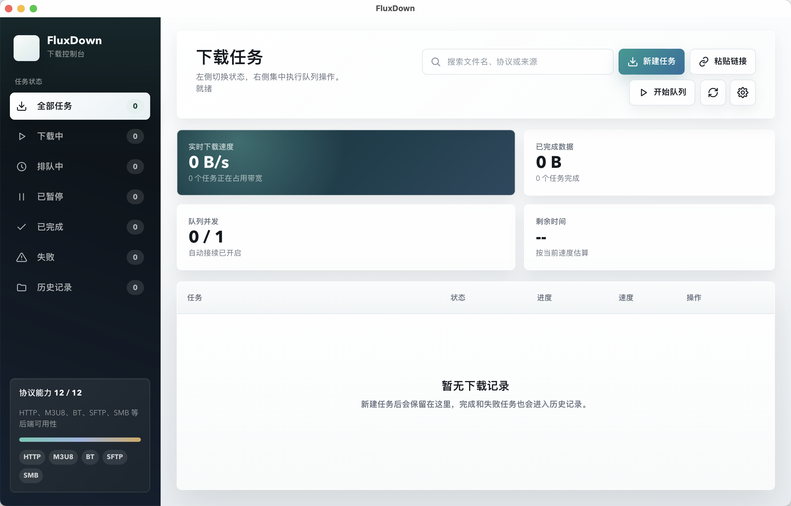
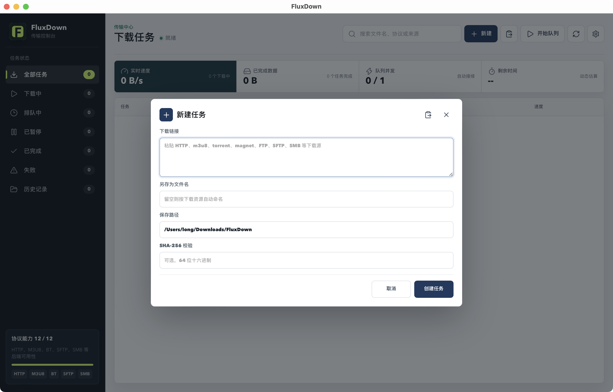
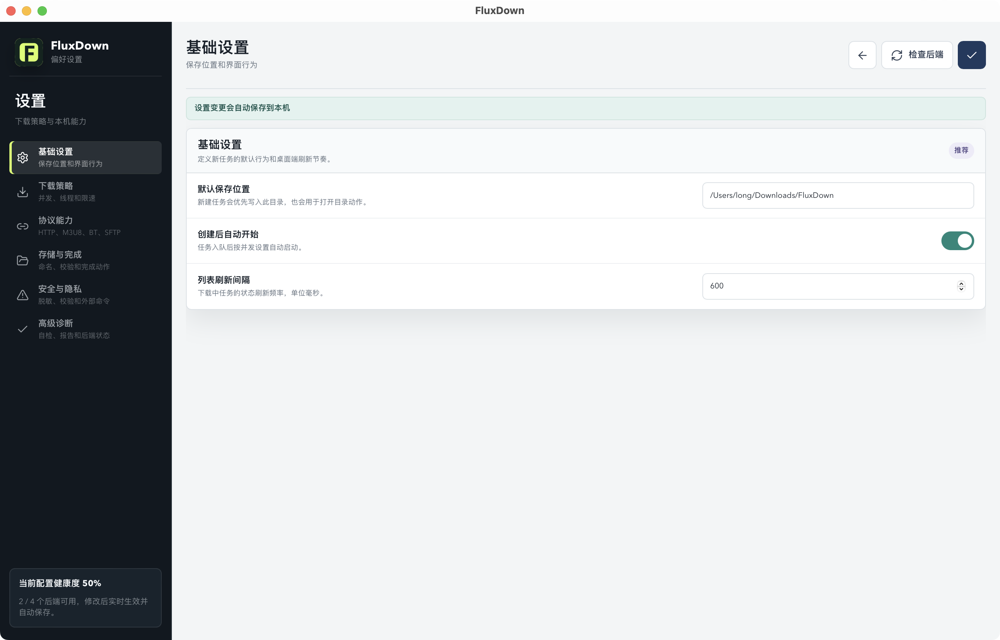
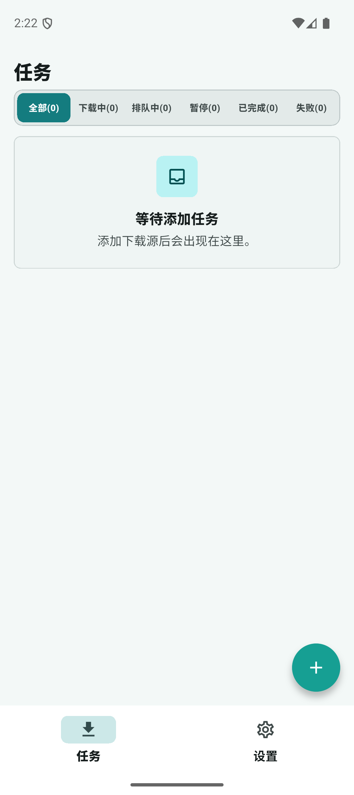
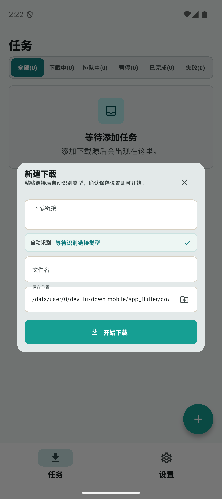
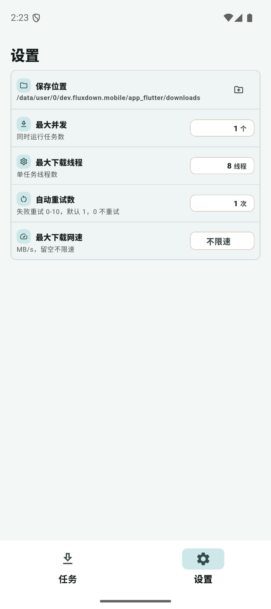

# FluxDown

[中文](README.md)

FluxDown is a multi-protocol downloader for desktop and mobile. The current version is `1.0.7`; see the latest release at [FluxDown 1.0.7](https://github.com/lonnnnnng/fluxdown/releases/tag/v1.0.7).

## Current Status

- Desktop supports Windows, macOS, and Linux, with the `fluxdown` CLI and a Tauri + React GUI.
- Mobile supports Android and iPhone through a Flutter app.
- The desktop GUI is focused on two pages, download queue and settings, with a compact state rail, transfer metrics, and task table. The mobile home screen keeps the queue and settings entry.
- Desktop task rows start or pause on click; right-click, long press, or the overflow button opens actions for copy, open, share, properties, redownload, and delete.
- New task creation supports pasted links, save-as file names, output location selection, and SHA-256 verification. Mobile additionally supports QR scanning.
- Settings cover download location, concurrent downloads, download thread count, auto retry count, and max download speed.
- Supported protocols include HTTP/HTTPS, WebDAV/WebDAVS, FTP/FTPS, m3u8/HLS, SFTP, SMB, `.torrent`, Magnet, and ed2k handoff.
- Torrent and Magnet tasks switch to the real file name after metadata is available. Android supports multi-file selection, while desktop CLI/Tauri commands support selecting files by torrent file index.
- Mobile HLS downloads produce a final `.mp4`, with smoke coverage for fMP4, BYTERANGE, and TS HLS. Desktop output follows the core and available FFmpeg capabilities.
- CLI and desktop redact usernames and passwords in URLs, and sanitize save-as names to a single file name.
- Normal commits and tag pushes do not trigger GitHub Actions. CI is run manually only for explicit packaging or release work.

## Screenshots

### macOS Desktop

| Queue | New Task | Settings |
| --- | --- | --- |
|  |  |  |

### Android Emulator (Pixel_9)

| Queue | New Task | Settings |
| --- | --- | --- |
|  |  |  |

## Verification Boundary

| Platform | Verified | Still Needed |
| --- | --- | --- |
| macOS Desktop/CLI | Release CLI covers HTTP/HLS/FTP/FTPS/SFTP/SMB/Torrent/Magnet plus queue controls. Foreground desktop GUI covers HTTP/HLS/Torrent/Magnet. Tauri commands cover HTTP/HLS/WebDAV/FTP/FTPS/SFTP/SMB/Torrent/Magnet. | Pure GUI click-through coverage for FTP/FTPS/SFTP/SMB/WebDAV still needs a separate pass. |
| Windows Desktop/CLI | CI artifacts have been published. A Windows development machine completed CLI real-download validation for 12 protocol cases and native Tauri GUI foreground validation for 12 protocol cases. ed2k completed the product-defined system handoff flow. | ed2k is not completed by FluxDown's own internal downloader. GUI verification used a dedicated E2E window and isolated queue. |
| Linux Desktop/CLI | CI builds Linux CLI, GUI executable, `.deb`, and `.rpm` artifacts and checks that they are non-empty. | Installing the Linux GUI in a desktop environment and completing a real download is still pending. |
| Android App | Redmi Note 8 Pro real-device coverage includes local HTTP/HTTPS/FTP/FTPS/SFTP/SMB, small HLS, small torrent, small magnet, media-sized HLS, single/multi-file torrent, and magnet. Pixel_9 emulator screenshots are current. | Store distribution still needs signing, license, and background-behavior checks. |
| iOS App | CI builds the iOS simulator app and unsigned device app. iOS simulator smoke covers HTTP, fMP4 HLS, BYTERANGE HLS, and TS HLS downloads. | Signed IPA, iPhone installation, QR scanning, file picking, share/open flows, and physical-device capabilities are still pending. |

See [Download verification status](docs/download-verification.md) for detailed evidence.

## Quick Start

### CLI

```sh
cargo run -p fluxdown-cli -- doctor
cargo run -p fluxdown-cli -- detect "https://example.com/file.zip"
cargo run -p fluxdown-cli -- download "https://example.com/file.zip" --output ./downloads
cargo run -p fluxdown-cli -- add "https://example.com/file.zip" --output ./downloads
cargo run -p fluxdown-cli -- run --concurrency 2
```

`download` runs immediately and prints a JSON summary. `add` writes a task into the queue. `run` executes queued tasks with the requested concurrency. `--sha256 <64-char-hex>` verifies the final file.

### Desktop

```sh
npm install
npm run desktop:build
```

On macOS, the app bundle is generated at `target/release/bundle/macos/FluxDown.app`. For development, run `npm run desktop:web` and `npm run desktop:dev`.

### Android

```sh
cd apps/mobile
flutter analyze
flutter test
flutter build apk --debug
flutter build apk --release
```

### iOS

```sh
cd apps/mobile
flutter build ios --simulator
LANG=en_US.UTF-8 LC_ALL=en_US.UTF-8 flutter build ios --no-codesign
```

A signed IPA requires an Apple certificate, provisioning profile, Team ID, and keychain password. See [Build and release](docs/build-release.md).

## Release Assets

The `v1.0.7` release includes:

- Android debug APK, release APK, and release AAB
- iOS simulator app and unsigned device app
- macOS CLI, `.app.tar.gz`, and DMG
- Windows CLI, desktop exe, MSI, and NSIS installer
- Linux CLI, desktop executable, deb, and rpm
- Release manifest, LICENSE, and third-party license notices

Release page: [FluxDown 1.0.7](https://github.com/lonnnnnng/fluxdown/releases/tag/v1.0.7)

## Documentation

- [Documentation index](docs/README.md)
- [Requirements](docs/requirements.md)
- [Technical architecture](docs/architecture.md)
- [Protocol support matrix](docs/protocols.md)
- [Download verification status](docs/download-verification.md)
- [Build and release](docs/build-release.md)
- [Third-party licenses](docs/third-party-licenses.md)
- [Operations and security](docs/operations-security.md)
- [Roadmap](docs/roadmap.md)

## License

FluxDown's own code is released under the MIT License; see [LICENSE](LICENSE). Mobile torrent/magnet support uses `libtorrent_flutter`, which includes GPL-licensed native components. Store distribution needs a license-obligation review; see [Third-party licenses](docs/third-party-licenses.md).
