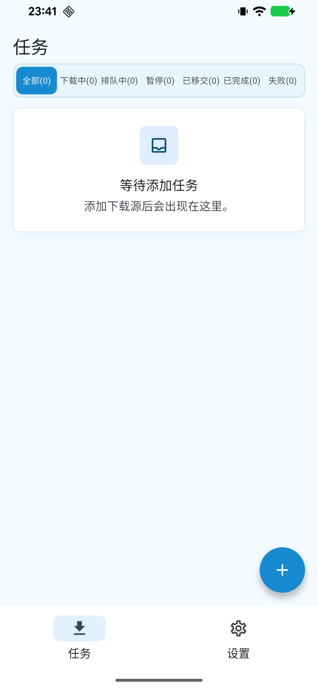
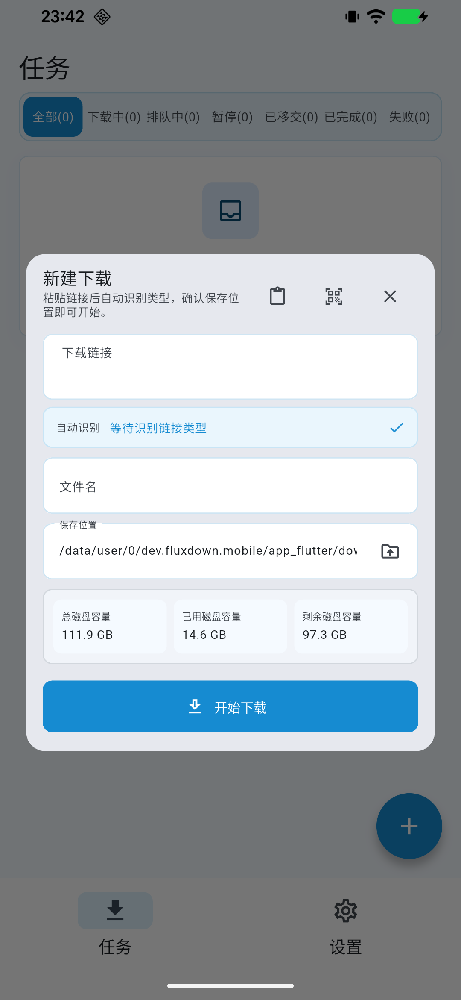
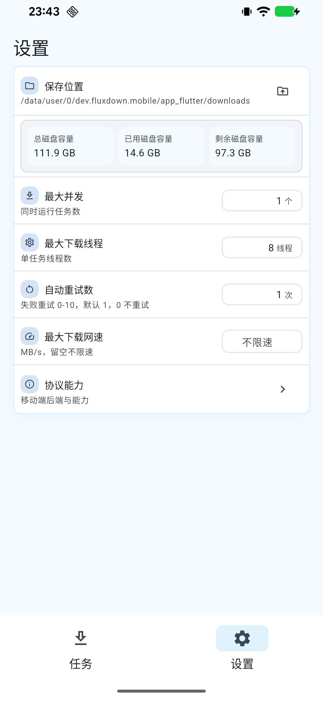

# FluxDown

[中文](README.md)

FluxDown is a multi-protocol downloader for desktop and mobile. The current version is [1.0.17](https://github.com/lonnnnnng/fluxdown/releases/tag/v1.0.17). Features below describe the current source; historical verification is labeled separately.

## Current Status

- Desktop supports Windows, macOS, and Linux, with the `fluxdown` CLI and a Tauri + React GUI.
- Mobile supports Android and iPhone through a Flutter app.
- The desktop GUI is focused on two pages, download queue and settings, with a compact state rail, transfer metrics, and task table. The mobile home screen keeps the queue and settings entry.
- Desktop task rows start or pause on click; right-click, long press, or the overflow button opens actions for copy, open, share, properties, redownload, and delete.
- New tasks support link input, automatic protocol detection and naming, save-as names, and output locations. Desktop, CLI, and mobile support optional SHA-256 file verification. Mobile also offers QR scanning and clipboard input.
- Settings cover download location, concurrent downloads, download thread count, auto retry count, and max download speed.
- Desktop supports a system tray, close-to-tray behavior, single-instance protection, completion/failure notifications, and optional clipboard monitoring, plus update checks, installer downloads, and window-size restoration.
- Desktop tasks show ETA and support per-task limits that override the global download speed limit. Mobile currently uses global download settings.
- Supported protocols include HTTP/HTTPS, WebDAV/WebDAVS, FTP/FTPS, m3u8/HLS, SFTP, SMB, `.torrent`, Magnet, and ed2k handoff.
- Torrent/Magnet tasks use real names after metadata is available. Mobile supports file selection and folder details; desktop CLI/Tauri commands accept file indices. Desktop details show files, trackers, peers, and session rates. Current source adds runtime per-file progress; static metadata does not imply downloaded bytes.
- HLS supports master variant selection, cached-segment resume, and optional TS output across desktop, CLI, and the mobile new-task form. Remuxing to `.mp4` is attempted when supported; failures safely fall back to `.ts`.
- Mobile speed limiting, cancellation-aware pause, chunk cancellation for FTP/SFTP/SMB/HLS, and Torrent speed settings are wired through the download controller. Successful ed2k handoff uses `handedOff` and is not reported as an internal FluxDown download completion.
- CLI and desktop redact usernames and passwords in URLs, and sanitize save-as names to a single file name.
- Mobile protocol detection tries Rust through FFI, with a Dart fallback when unavailable. Its queue and actual downloads still use Dart/native mobile adapters; migration to the Rust download engine is not complete.
- Normal commits and tag pushes do not trigger GitHub Actions. CI is run manually only for explicit packaging or release work.

### 1.0.17 Update (2026-09-08)

Fixed the Windows desktop binary being linked as a Console subsystem application. Launching the app no longer opens an accompanying command window, and closing an unrelated console no longer terminates the app. Optional backend probes no longer flash console windows on Windows. Release validation now checks the PE subsystem of the actual desktop and CLI binaries. See the [release notes](docs/releases/1.0.17.md) and [verification record](docs/download-verification.md) (Chinese).

### 1.0.16 Update (2026-09-08)

Fixed iOS FFI linkage, mobile JSON decoding/memory ownership, desktop Torrent per-file progress, and cross-process queue writes. Public assets contain 11 uploaded files, or 13 entries including source archives. Conservative binary trimming, separate Dart symbols, and package compression retain all protocols and three Android ABIs. See the [release notes](docs/releases/1.0.16.md), [size optimization record](docs/release-size-optimization.md), and [fix verification report](docs/bugfix-verification-20260908.md) (Chinese).

## Screenshots

### macOS Desktop

Historical captures from 2026-08-04 through 08-06 (`1.0.8`/`1.0.9` development). They do not show later tray, update, or Torrent details enhancements.

| Queue | New Task | Settings |
| --- | --- | --- |
|  |  |  |

### Android Real Device (Redmi Note 8 Pro)

Captured on 2026-08-20 using the `1.0.10+11` release APK, not the current source. These images predate the SHA-256 input.

| Queue | New Task | Settings |
| --- | --- | --- |
|  |  |  |

## Verification Boundary

| Platform | Verified | Still Needed |
| --- | --- | --- |
| macOS Desktop/CLI | Release CLI covers HTTP/HLS/FTP/FTPS/SFTP/SMB/Torrent/Magnet plus queue controls. Foreground desktop GUI has completed real validation for 12 protocol cases. Tauri commands cover HTTP/HLS/WebDAV/FTP/FTPS/SFTP/SMB/Torrent/Magnet. | ed2k is handed off to an external client by product definition; WebDAV/WebDAVS transport mapping is verified, while full directory traversal still needs a separate pass. |
| Windows Desktop/CLI | CI artifacts have been published. A Windows development machine completed CLI real-download validation for 12 protocol cases and native Tauri GUI foreground validation for 12 protocol cases. ed2k completed the product-defined system handoff flow. In `1.0.11`, CLI and native GUI were re-verified against real public internet resources (Cloudflare, curl.se, Apple BipBop, Rebex, Debian) covering HTTP/HTTPS, FTP, SFTP, HLS, queue controls, and speed limiting; see the [Windows real-resource verification report](docs/windows-real-resource-verification.md). | ed2k is not completed by FluxDown's own internal downloader. GUI verification used a dedicated E2E window and isolated queue. FTPS servers that enforce TLS session reuse (vsftpd default config, Rebex) are not supported for data transfer yet; this is an upstream suppaftp engine limitation ([suppaftp#93](https://github.com/veeso/suppaftp/issues/93)). |
| Linux Desktop/CLI | CI builds Linux CLI, GUI executable, `.deb`, and `.rpm` artifacts and checks that they are non-empty. | Installing the Linux GUI in a desktop environment and completing a real download is still pending. |
| Android App | Historical `1.0.4` coverage includes multiple protocols and single/multi-file Torrent/Magnet. The `1.0.10+11` Redmi Note 8 Pro pass covered installation, startup, queue, dialogs, settings, QR/clipboard entries, and storage capacity. This fix passes 50 Flutter tests, including host Rust FFI tests, not Android native-device validation. | Rerun current-source protocols and native FFI packaging/loading on device. Store distribution also needs signing, license, and background checks. |
| iOS App | Historical simulator smoke covers HTTP and fMP4/BYTERANGE/TS HLS. Local simulator and unsigned device builds pass on 2026-09-08, with all 8 FFI exports checked in the linked binaries. Build outputs remain in Actions Artifacts. | No new in-app download pass. Signed IPA and physical iPhone QR, file picking, and share/open checks remain pending. There is no end-user iOS installation package in Release. |

Historical download results do not replace regression testing on current source. See [Download verification status](docs/download-verification.md) for evidence.

## Quick Start

### CLI

```sh
cargo run -p fluxdown-cli -- doctor
cargo run -p fluxdown-cli -- detect "https://example.com/file.zip"
cargo run -p fluxdown-cli -- download "https://example.com/file.zip" --output ./downloads
cargo run -p fluxdown-cli -- add "https://example.com/file.zip" --output ./downloads
cargo run -p fluxdown-cli -- run --concurrency 2
# Select the second master-playlist variant and keep the TS output
cargo run -p fluxdown-cli -- download "https://example.com/master.m3u8" --output ./downloads --hls-variant-index 1 --hls-keep-ts
```

`download` runs immediately and prints a JSON summary. `add` writes a task into the queue. `run` executes queued tasks with the requested concurrency. `--sha256 <64-char-hex>` verifies the final file. HLS commands accept `--hls-variant-index <index>` (zero-based) and `--hls-keep-ts`; `download`/`add` save these task options, while `start`/`run` can temporarily select a variant or enable TS output.

### Desktop

```sh
npm ci
npm run desktop:build
```

On macOS, the app bundle is generated at `target/release/bundle/macos/FluxDown.app`. Run `npm run desktop:dev` for native development, or `npm run desktop:web` for a frontend-only preview.

### Android

```sh
cd apps/mobile
flutter analyze
flutter test
flutter build apk --debug
flutter build apk --release
```

These Flutter commands do not compile Android Rust libraries. Follow [mobile FFI builds](docs/build-release.md#移动端-rust-ffi) to populate `jniLibs` first. Without the library, protocol detection falls back to Dart; a working app alone does not prove FFI works.

### iOS

```sh
rustup target add aarch64-apple-ios aarch64-apple-ios-sim x86_64-apple-ios
cd apps/mobile
flutter build ios --simulator
LANG=en_US.UTF-8 LC_ALL=en_US.UTF-8 flutter build ios --no-codesign
```

Runner automatically builds and statically links Rust FFI, targeting iOS 15.0 or later. A signed IPA additionally requires an Apple certificate, provisioning profile, Team ID, and keychain password. See [Build and release](docs/build-release.md).

## Release Assets

Starting with `v1.0.16`, a standard release contains 11 uploaded files, plus GitHub's two automatic source archives, for 13 entries:

| Purpose | Downloads |
| --- | --- |
| Mobile installation | Android release APK |
| Desktop installation | Windows x64 Setup EXE, macOS ARM64 DMG, Linux x64 DEB/RPM |
| Command line | Windows x64 CLI ZIP; macOS ARM64 / Linux x64 CLI TAR.GZ |
| Verification and notices | Release manifest (sizes/SHA-256), LICENSE, third-party license notices |

Debug APK, AAB, iOS validation bundles, MSI, raw desktop binaries, and the macOS App directory remain in the corresponding Actions Artifacts, outside the end-user download list. See the [release notes](docs/releases/1.0.17.md) for signing and verification limits.

Extract the CLI archive and run `fluxdown` / `fluxdown.exe`; Unix executable permissions are retained. Android still includes arm64-v8a, armeabi-v7a, and x86_64. Release uses R8; Dart symbols and R8 mapping are retained separately in Actions Artifacts.

Release page: [FluxDown 1.0.17](https://github.com/lonnnnnng/fluxdown/releases/tag/v1.0.17).

## Documentation

- [Documentation index](docs/README.md)
- [Requirements](docs/requirements.md)
- [Technical architecture](docs/architecture.md)
- [Protocol support matrix](docs/protocols.md)
- [Download verification status](docs/download-verification.md)
- [2026-09-08 fix verification and documentation audit](docs/bugfix-verification-20260908.md)
- [Build and release](docs/build-release.md)
- [Third-party licenses](docs/third-party-licenses.md)
- [Operations and security](docs/operations-security.md)
- [Roadmap](docs/roadmap.md)

## License

FluxDown's own code is released under the MIT License; see [LICENSE](LICENSE). Mobile torrent/magnet support uses `libtorrent_flutter`, which includes GPL-licensed native components. Store distribution needs a license-obligation review; see [Third-party licenses](docs/third-party-licenses.md).
