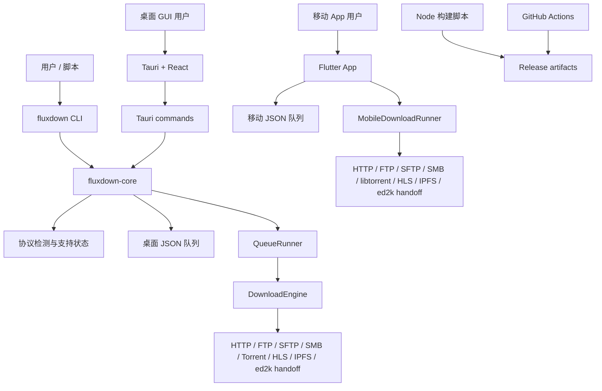
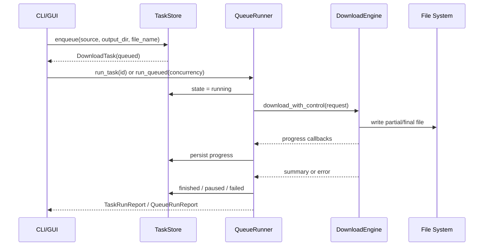
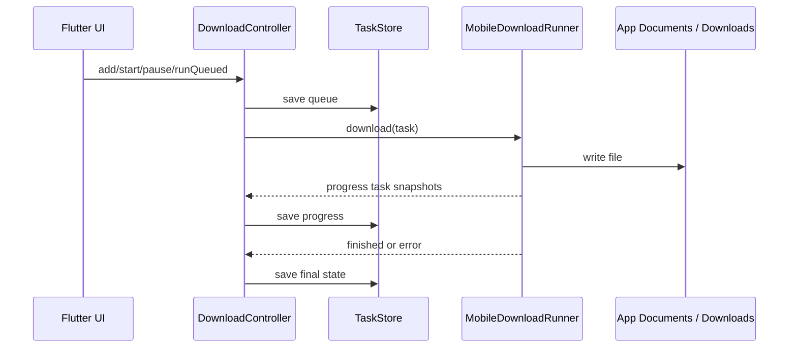

# 技术架构

## 总览

FluxDown 是一个多语言 monorepo：

- Rust workspace：共享下载核心、任务队列和 CLI。
- Tauri + React：桌面 GUI，调用 Rust core 暴露的 Tauri commands。
- Flutter：Android/iOS App，移动端使用 Dart 实现本地队列和下载调度。
- Node scripts：构建、验证、打包、Release staging 和 manifest 生成。
- GitHub Actions：多平台 CI 构建和 GitHub Release 发布。

## 仓库结构

| 路径 | 作用 |
| --- | --- |
| `crates/fluxdown-core` | Rust 核心库：协议检测、支持状态、任务模型、任务存储、队列运行器、桌面下载引擎。 |
| `crates/fluxdown-cli` | CLI 入口，基于 `clap` 暴露检测、诊断、下载和队列命令。 |
| `apps/desktop` | Tauri + React 桌面 GUI。前端在 `src`，Rust Tauri 入口在 `src-tauri`。 |
| `apps/mobile` | Flutter Android/iOS App。下载调度和协议适配在 `lib/src`。 |
| `scripts` | 本地构建、Docker 交叉构建、产物校验、发布 staging 和 manifest 脚本。 |
| `.github/workflows/build.yml` | 多端 CI 和标签发布流水线。 |
| `docs` | 产品、业务、技术、发布和运维文档。 |

## Rust core

### 协议检测

`crates/fluxdown-core/src/protocol.rs` 定义：

- `Protocol`：`http`、`https`、`webdav`、`webdavs`、`ftp`、`ftps`、`torrent`、`magnet`、`ed2k`、`m3u8`、`sftp`、`smb`、`ipfs`、`unknown`。
- `Backend`：`built-in`、`system-handoff`、`aria2`、`amule`、`smb-client`、`ipfs`、`planned`。
- `SupportStatus` 和 `RuntimeSupportStatus`：区分“协议理论支持”和“当前机器是否可执行”。
- `DoctorReport`：汇总后端和协议运行状态。

大部分协议当前映射到 `BuiltIn` 后端。ed2k 在桌面端优先检查 aMule `ed2k` CLI，缺失时退回系统 URL handler。

### 任务模型

`crates/fluxdown-core/src/task.rs` 定义 `DownloadTask`：

- 身份：`id`。
- 来源：`source`、`protocol`、`support`。
- 状态：`queued`、`running`、`finished`、`failed`、`paused`。
- 输出：`output_dir`、`file_name`。
- 进度：`total_bytes`、`downloaded_bytes`。
- 错误：`error`。
- 时间：`created_at_ms`、`updated_at_ms`。

这个模型被 CLI、桌面 GUI 和桌面队列运行器共享。移动端有 Dart 版本的 `DownloadTask`，字段语义保持接近，但 JSON 文件格式和存储位置不同。

### 队列存储

`crates/fluxdown-core/src/store.rs` 使用本地 JSON 文件保存桌面队列：

- 默认路径：`$XDG_DATA_HOME/fluxdown/queue.json`，未设置时使用 `~/.local/share/fluxdown/queue.json`，再退回当前目录。
- 写入方式：先写临时文件，再原子替换目标文件。
- 进程内写锁：避免同一进程内并发写入打坏 JSON。
- CLI 可通过 `--store /path/to/queue.json` 覆盖默认路径。

注意：默认路径使用 Unix 风格环境变量；Windows 运行时仍可使用 `--store` 明确指定队列文件。后续可以改为平台原生数据目录。

### 队列运行器

`crates/fluxdown-core/src/runner.rs` 提供：

- `run_task(id)`：执行单个任务。
- `run_queued(concurrency)`：按有界并发执行所有 `queued` 任务。
- 进度持久化节流：约 250ms 写一次队列。
- 暂停检测：通过队列状态变化触发 `CancelToken`，下载器返回 `Paused` 后保留部分文件。

### 下载引擎

`crates/fluxdown-core/src/downloader.rs` 是桌面下载执行层。核心职责：

- 根据 `DownloadRequest.protocol()` 分发到对应下载方法。
- 为支持的协议写入输出目录和文件。
- 报告 `DownloadProgress` 和 `DownloadSummary`。
- 处理取消、部分文件和断点续传。

主要依赖：

- `reqwest`：HTTP/HTTPS/WebDAV/IPFS 网关。
- `suppaftp`：FTP/FTPS。
- `ssh2`：SFTP。
- `smb2`：SMB2/3。
- `librqbit`：BitTorrent 和 Magnet。
- `m3u8-rs`、`aes`、`cbc`：HLS 解析和 AES-128 分片解密。
- `open` 和 `tokio::process::Command`：ed2k 外部移交。

## CLI

`crates/fluxdown-cli/src/main.rs` 是薄封装层：

- 参数解析使用 `clap`。
- 命令输出使用 JSON 或简单协议名。
- 下载和队列逻辑全部委托给 `fluxdown-core`。

CLI 是验证核心能力的主入口，也是发布二进制产物中最容易自动化测试的部分。

## 桌面 GUI

桌面端分两层：

- React 前端：负责表单、任务列表、按钮状态和进度展示。
- Tauri Rust 后端：在 `apps/desktop/src-tauri/src/main.rs` 暴露 commands。

Tauri commands 包括：

- `detect`
- `support`
- `doctor`
- `plan_download`
- `enqueue_download`
- `list_downloads`
- `pause_download`
- `resume_download`
- `remove_download`
- `start_download`
- `run_queue`

这些 commands 直接调用 Rust core，因此桌面 GUI 和 CLI 的协议能力基本一致。

## 移动端

Flutter App 没有直接复用 Rust core。当前移动端在 Dart 层实现协议检测、队列和下载调度：

- `protocol.dart`：协议识别和移动端支持说明。
- `download_task.dart`：任务模型、文件名推断、格式化。
- `task_store.dart`：App documents 目录下的 `fluxdown/queue.json`。
- `download_controller.dart`：添加、删除、暂停、启动和有界并发队列运行。
- `mobile_downloader.dart`：移动端协议分发。
- `mobile_ftp.dart`、`mobile_sftp.dart`、`mobile_smb.dart`、`mobile_torrent.dart`、`mobile_ed2k.dart`：协议适配。

移动端与桌面端的主要差异：

- 移动端任务 JSON 是数组，桌面端队列 JSON 是 `{ "tasks": [...] }`。
- 移动端输出目录在 App 沙盒内由 UI 选择或默认生成。
- 移动端 ed2k 只能移交给已安装兼容 App。
- 移动端 torrent 依赖 `libtorrent_flutter` 原生组件。

## 数据流

### 桌面队列任务

### 移动队列任务

## 错误处理

- Rust core 使用 `thiserror` 定义结构化错误。
- CLI 将成功结果序列化为 JSON；错误由 `anyhow` 向上返回。
- 队列运行器把下载错误写入任务 `error` 字段并标记 `failed`。
- 移动端捕获异常并写入任务 `error` 字段。
- 暂停被视为受控状态，不写入错误。

## 设计取舍

- Rust core 先服务桌面端，移动端使用 Dart 原生实现，避免早期引入复杂 FFI。
- 队列采用本地 JSON，便于调试和迁移，但不适合多进程高并发写入。
- IPFS 当前通过公共网关实现，降低部署复杂度，但可用性受网关影响。
- ed2k 采用外部移交，缩小实现面，但进度和完成状态不可由 FluxDown 完整掌控。
- HLS 当前聚焦 VOD 下载，不承诺直播、DRM 或复杂多码率选择策略。
