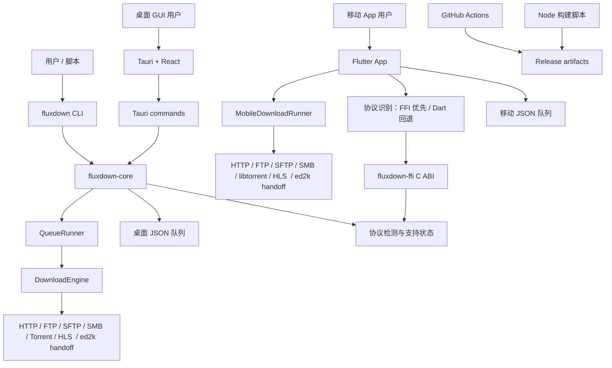
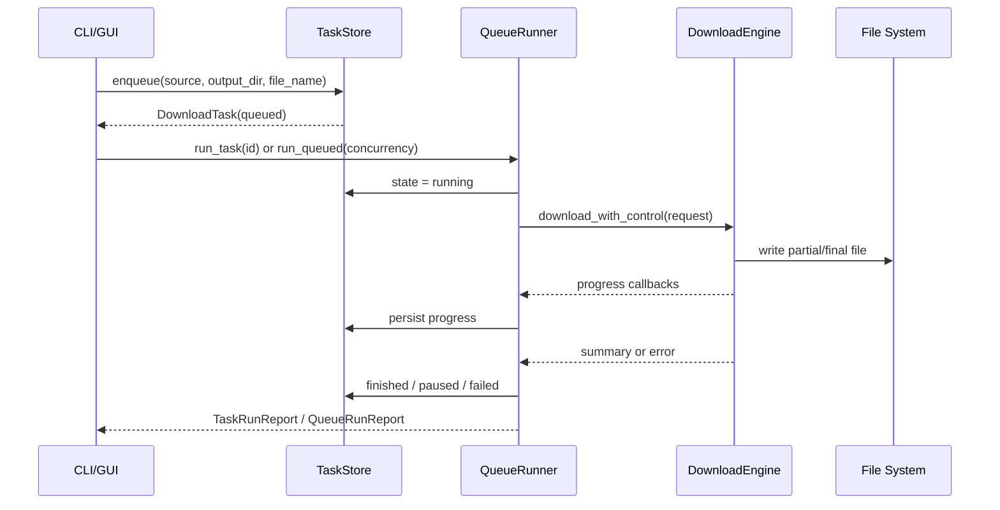
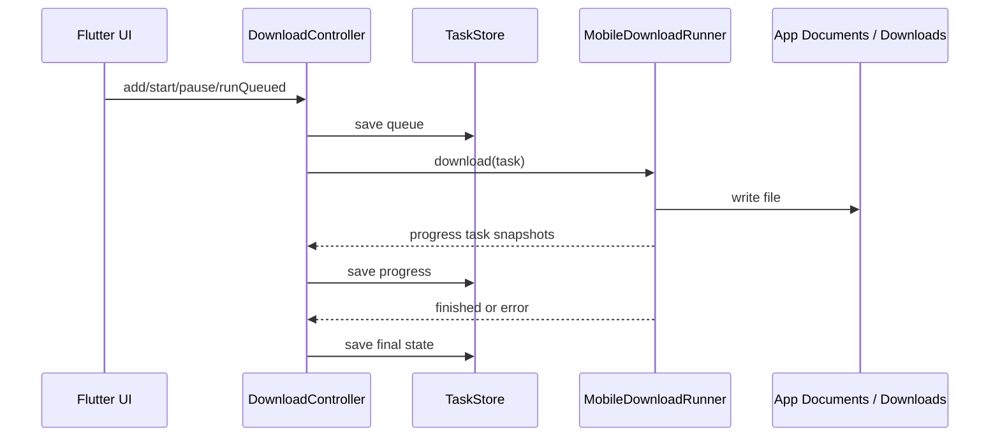

# 技术架构

## 总览

FluxDown 是一个多语言 monorepo：

- Rust workspace：共享下载核心、任务队列、CLI 和 C ABI 桥接库。
- Tauri + React：桌面 GUI，调用 Rust core 暴露的 Tauri commands。
- Flutter：Android/iOS App，协议识别优先经 FFI 调用 Rust；本地队列与下载调度仍使用 Dart 和移动原生适配器。
- Node scripts：构建、验证、打包、Release staging 和 manifest 生成。
- GitHub Actions：多平台 CI 构建和 GitHub Release 发布。

```mermaid
flowchart TD
    UserCLI["用户 / 脚本"] --> CLI["fluxdown CLI"]
    UserDesktop["桌面 GUI 用户"] --> Desktop["Tauri + React"]
    UserMobile["移动 App 用户"] --> Mobile["Flutter App"]

    CLI --> Core["fluxdown-core"]
    Desktop --> TauriCommands["Tauri commands"]
    TauriCommands --> Core

    Core --> Protocol["协议检测与支持状态"]
    Core --> Store["桌面 JSON 队列"]
    Core --> Runner["QueueRunner"]
    Runner --> Engine["DownloadEngine"]
    Engine --> DesktopBackends["HTTP / FTP / SFTP / SMB / Torrent / HLS  / ed2k handoff"]

    Mobile --> MobileStore["移动 JSON 队列"]
    Mobile --> Detection["协议识别：FFI 优先 / Dart 回退"]
    Detection --> FFI["fluxdown-ffi C ABI"]
    FFI --> Protocol
    Mobile --> MobileRunner["MobileDownloadRunner"]
    MobileRunner --> MobileBackends["HTTP / FTP / SFTP / SMB / libtorrent / HLS  / ed2k handoff"]

    Scripts["Node 构建脚本"] --> Artifacts["Release artifacts"]
    CI["GitHub Actions"] --> Artifacts
```

## 仓库结构

| 路径 | 作用 |
| --- | --- |
| `crates/fluxdown-core` | Rust 核心库：协议检测、支持状态、任务模型、任务存储、队列运行器、桌面下载引擎。 |
| `crates/fluxdown-cli` | CLI 入口，基于 `clap` 暴露检测、诊断、下载和队列命令。 |
| `crates/fluxdown-ffi` | ABI 1：协议识别/支持、原生队列 add/list/run 和 UTF-8 结果释放；移动产品目前只接入协议识别。 |
| `apps/desktop` | Tauri + React 桌面 GUI。前端在 `src`，Rust Tauri 入口在 `src-tauri`。 |
| `apps/mobile` | Flutter Android/iOS App。下载调度和协议适配在 `lib/src`。 |
| `scripts` | 本地构建、Docker 交叉构建、产物校验、发布 staging 和 manifest 脚本。 |
| `.github/workflows/build.yml` | 仅手动触发的多端打包/发布流水线，普通 push/tag 不触发。 |
| `docs` | 产品、业务、技术、发布和运维文档。 |

## Rust core

### 协议检测

`crates/fluxdown-core/src/protocol.rs` 定义：

- `Protocol`：`http`、`https`、`webdav`、`webdavs`、`ftp`、`ftps`、`torrent`、`magnet`、`ed2k`、`m3u8`、`sftp`、`smb`、`unknown`。
- `Backend`：`built-in`、`system-handoff`、`aria2`、`amule`、`smb-client`、`planned`。
- `SupportStatus` 和 `RuntimeSupportStatus`：区分“协议理论支持”和“当前机器是否可执行”。
- `DoctorReport`：汇总后端和协议运行状态。

大部分协议当前映射到 `BuiltIn` 后端。ed2k 在桌面端优先检查 aMule `ed2k` CLI，缺失时退回系统 URL handler。

### 任务模型

`crates/fluxdown-core/src/task.rs` 定义 `DownloadTask`：

- 身份：`id`。
- 来源：`source`、`protocol`、`support`。
- 状态：桌面 Rust core 使用 `queued`、`running`、`finished`、`failed`、`paused`；移动端额外使用 `handedOff` 表示 ed2k 已交给外部兼容 App，不能把外部 App 的传输结果当作 FluxDown 内建下载完成。
- 输出：`output_dir`、`file_name`。
- 校验：`expected_sha256`。
- 每任务选项：`torrent_file_indices`、`speed_limit_mbps`（历史字段名，实际单位 MiB/s）、`hls_variant_index`、`hls_keep_transport_stream`。
- 进度：`total_bytes`、`downloaded_bytes`。
- 速率：`current_speed_bytes_per_second`；桌面 UI 根据剩余字节与速率计算 ETA。
- 错误：`error`。
- 时间：`created_at_ms`、`updated_at_ms`、`started_at_ms`、`finished_at_ms`。

这个模型被 CLI、桌面 GUI 和桌面队列运行器共享。移动端有独立 Dart `DownloadTask`，FFI 的 `FluxDownCoreTask` 只是 Rust 任务的字段子集投影，不能替代移动端任务持久化。字段和边界见 [任务模型与 FFI](task-schema.md)，当前没有跨端队列自动转换器。

### 队列存储

`crates/fluxdown-core/src/store.rs` 使用本地 JSON 文件保存桌面队列：

- macOS 默认路径：未设置 `XDG_DATA_HOME` 时使用 `~/Library/Application Support/FluxDown/queue.json`；如果新路径不存在且旧版 `~/.local/share/fluxdown/queue.json` 存在，会先读取旧队列并在下一次写入时迁移到新路径。
- Windows 默认路径：优先使用 `%APPDATA%/FluxDown/queue.json`，再退回用户目录下的 `AppData/Roaming/FluxDown/queue.json`。
- Linux / 其他 Unix 默认路径：`$XDG_DATA_HOME/fluxdown/queue.json`，未设置时使用 `~/.local/share/fluxdown/queue.json`，再退回当前目录。
- 写入方式：先写临时文件，再原子替换目标文件。
- 进程内互斥与跨进程文件锁：`queue.json.lock` 保护完整的读改写，避免多个 CLI 的进度、新建、暂停和删除覆盖彼此；旁路锁文件长期保留，文件句柄关闭时释放系统锁，不随队列原子替换而失效。系统锁通过阻塞线程池获取。
- CLI 可通过 `--store /path/to/queue.json` 覆盖默认路径。

### 队列运行器

`crates/fluxdown-core/src/runner.rs` 提供：

- `run_task(id)`：执行单个任务。
- `run_queued(concurrency)`：按有界并发执行所有 `queued` 任务。
- 进度持久化节流：约 250ms 写一次队列。
- 暂停检测：通过队列状态变化触发 `CancelToken`，下载器返回 `Paused` 后保留部分文件。
- 跨进程删除：发现任务不再存在时取消下载，收尾不恢复任务，也不把已删除任务计作完成。

### 下载引擎

`crates/fluxdown-core/src/downloader.rs` 是桌面下载执行层。核心职责：

- 根据 `DownloadRequest.protocol()` 分发到对应下载方法。
- 为支持的协议写入输出目录和文件。
- 报告 `DownloadProgress` 和 `DownloadSummary`。
- 处理取消、部分文件和断点续传。
- 桌面/core HLS 支持 master variant 选择、分片缓存恢复和可选 TS 直出；移动端 Dart 下载器也支持相同的 variant/TS 任务选项，但与 Rust FFI 队列投影独立。
- Torrent 引擎保留活动会话，供详情接口读取分文件字节数、tracker、peer 和会话速率；静态 metadata 只有文件清单与大小，不代表已下载进度。

主要依赖：

- `reqwest`：HTTP/HTTPS/WebDAV 网关。
- `suppaftp`：FTP/FTPS。
- `ssh2`：SFTP。
- `smb2`：SMB2/3。
- `librqbit`：BitTorrent 和 Magnet。
- `m3u8-rs`、`aes`、`cbc`：HLS 解析和 AES-128 分片解密。
- `open` 和 `tokio::process::Command`：ed2k 外部移交。

## CLI

`crates/fluxdown-cli/src/main.rs` 是薄封装层：

- 参数解析使用 `clap`。
- 命令输出使用 JSON 或简单协议名。
- 下载和队列逻辑全部委托给 `fluxdown-core`。

CLI 是验证核心能力的主入口，也是发布二进制产物中最容易自动化测试的部分。

## 桌面 GUI

桌面端分两层：

- React 前端：负责表单、任务列表、按钮状态和进度展示。
- Tauri Rust 后端：在 `apps/desktop/src-tauri/src/main.rs` 暴露 commands。

Tauri commands 包括：

- `detect`
- `support`
- `doctor`
- `plan_download`
- `enqueue_download`
- `list_downloads`
- `pause_download`
- `resume_download`
- `remove_download`
- `start_download`
- `run_queue`
- `torrent_task_details`、`list_hls_variants`

这些 commands 直接调用 Rust core，因此桌面 GUI 和 CLI 的协议能力基本一致。

前端从队列获取活动任务状态，在运行或排队中轮询 Torrent 会话详情。详情关闭或切换任务后丢弃迟到响应；静态详情的未知进度显示为未知，不从总任务状态推断每个文件已完成。分文件进度 UI 修复纳入 `1.0.16`，见 [验证记录](bugfix-verification-20260908.md)。

桌面壳还承担托盘、关窗驻留、单实例、系统通知、剪贴板监听和窗口尺寸持久化；更新检查/安装包下载经 Tauri 后端执行。这些是桌面平台能力，不是 Flutter 已同步的功能。

## 移动端

Flutter 当前部分复用 Rust core：协议识别走 `protocol.dart` → `FluxDownCoreBridge` → `FluxDownCoreFfi`；加载失败或调用异常回退 Dart。实际移动队列和下载尚未迁移到 Rust：

- `protocol.dart`：协议识别和移动端支持说明。
- `core_bridge.dart` / `ffi/fluxdown_ffi.dart`：加载 ABI 1、UTF-8 JSON 信封解码与结果释放。Android 打包 `.so`；iOS Runner 构建时静态链接，使用 `DynamicLibrary.process()`。
- `download_task.dart`：任务模型、文件名推断、格式化。
- `task_store.dart`：App documents 目录下的 `fluxdown/queue.json`。
- `download_controller.dart`：添加、删除、暂停、启动和有界并发队列运行。
- `mobile_downloader.dart`：移动端协议分发。
- `mobile_ftp.dart`、`mobile_sftp.dart`、`mobile_smb.dart`、`mobile_torrent.dart`、`mobile_ed2k.dart`：协议适配。

移动端与桌面端的主要差异：

- 移动端任务 JSON 是数组，桌面端队列 JSON 是 `{ "tasks": [...] }`。
- 移动端保存位置由设置提供默认值，新建任务可覆盖；Android 系统目录选择/导出受目录权限约束，不能等同于桌面任意路径写入。
- 移动端 ed2k 只能移交给已安装兼容 App；移交成功后任务状态为 `handedOff`。
- 移动端 torrent 依赖 `libtorrent_flutter` 原生组件。
- 移动端已接入新建弹框扫码/剪切板与可选 SHA-256 文件校验；不依赖 Rust 下载控制器。

FFI `queueRun` 会同步等待任务结束，当前仅在独立 host 测试中调用，不能直接接入 Flutter UI isolate。生产迁移还需要非阻塞执行、进度/取消接口、设置透传和队列模型转换。构建细节见 [移动端 Rust FFI](build-release.md#移动端-rust-ffi)。

## 数据流

### 桌面队列任务

```mermaid
sequenceDiagram
    participant UI as CLI/GUI
    participant Store as TaskStore
    participant Runner as QueueRunner
    participant Engine as DownloadEngine
    participant FS as File System

    UI->>Store: enqueue(source, output_dir, file_name)
    Store-->>UI: DownloadTask(queued)
    UI->>Runner: run_task(id) or run_queued(concurrency)
    Runner->>Store: state = running
    Runner->>Engine: download_with_control(request)
    Engine->>FS: write partial/final file
    Engine-->>Runner: progress callbacks
    Runner->>Store: persist progress
    Engine-->>Runner: summary or error
    Runner->>Store: finished / paused / failed
    Runner-->>UI: TaskRunReport / QueueRunReport
```

### 移动队列任务

```mermaid
sequenceDiagram
    participant App as Flutter UI
    participant Controller as DownloadController
    participant Store as TaskStore
    participant Runner as MobileDownloadRunner
    participant FS as App Documents / Downloads

    App->>Controller: add/start/pause/runQueued
    Controller->>Store: save queue
    Controller->>Runner: download(task)
    Runner->>FS: write file
    Runner-->>Controller: progress task snapshots
    Controller->>Store: save progress
    Runner-->>Controller: finished or error
    Controller->>Store: save final state
```

## 错误处理

- Rust core 使用 `thiserror` 定义结构化错误。
- CLI 将成功结果序列化为 JSON；错误由 `anyhow` 向上返回。
- 队列运行器把下载错误写入任务 `error` 字段并标记 `failed`。
- 移动端捕获异常并写入任务 `error` 字段。
- 暂停被视为受控状态，不写入错误。

## 设计取舍

- Rust core 先服务桌面端，移动端分阶段引入 FFI；目前只共享协议识别，下载路径仍分离，不能把绑定层存在写成引擎迁移完成。
- 队列采用本地 JSON，便于调试和迁移，但不适合多进程高并发写入。
- ed2k 采用外部移交，缩小实现面，但进度和完成状态不可由 FluxDown 完整掌控。
- HLS 当前聚焦 VOD 下载；桌面、CLI 和移动新建任务支持显式 variant 选择，但不承诺直播录制、DRM 或自适应码率切换。
